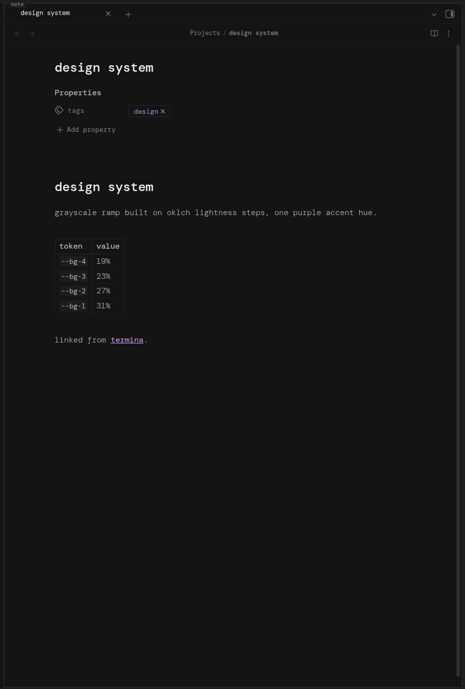

# termina

[](https://github.com/xevrion/obsidian-termina/releases/latest)
[](LICENSE)

A tui-style Obsidian theme. Every panel becomes a bordered box with a lowercase label, sharp corners, monospace everything.



No rounded corners, no fluff, just clean bordered panels like panes in a terminal multiplexer.

## Features

- Every panel (editor, sidebars, status bar, command palette) drawn as a bordered box with a lowercase label
- Zero rounded corners, anywhere
- Neutral oklch grayscale palette with a purple accent, dark and light
- Monospace throughout (DM Mono, falls back to JetBrains Mono / Fira Code)
- Every knob lives at the top of `theme.css`: gap size, border thickness, font, label color

## Installation

Search for **termina** in Settings > Appearance > Themes > Manage. (Not yet on the community theme browser, submission pending.)

### Manual

Download this repo (or clone it with git) and copy the folder into your vault's theme directory as `termina`, so you end up with `.obsidian/themes/termina/manifest.json`.

- macOS / Linux: `<your-vault>/.obsidian/themes/`
- Windows: `<your-vault>\.obsidian\themes\`

`.obsidian` is hidden, turn on "show hidden files" if you don't see it. Restart Obsidian afterward and enable termina in Settings > Appearance > Themes.

### With git

macOS / Linux:

```sh
git clone https://github.com/xevrion/obsidian-termina.git "<your-vault>/.obsidian/themes/termina"
```

Windows (PowerShell):

```powershell
git clone https://github.com/xevrion/obsidian-termina.git "<your-vault>\.obsidian\themes\termina"
```

If you'd rather keep the clone elsewhere and just link it in, symlink instead of copying:

```sh
ln -s /path/to/obsidian-termina "<your-vault>/.obsidian/themes/termina"
```

```powershell
New-Item -ItemType SymbolicLink -Path "<your-vault>\.obsidian\themes\termina" -Target "C:\path\to\obsidian-termina"
```

### Font

The theme is built around DM Mono. Without it, it falls back to JetBrains Mono, Fira Code, or whatever monospace font you have.

macOS: `brew install --cask font-dm-mono`, or grab it from [Google Fonts](https://fonts.google.com/specimen/DM+Mono) and install through Font Book.

Windows: download from [Google Fonts](https://fonts.google.com/specimen/DM+Mono), select all the .ttf files, right click, Install.

Arch: `yay -S ttf-dmmono`

Fedora / Ubuntu / most Linux:

```sh
mkdir -p ~/.local/share/fonts/dm-mono && cd ~/.local/share/fonts/dm-mono
for f in DMMono-Light DMMono-LightItalic DMMono-Regular DMMono-Italic DMMono-Medium DMMono-MediumItalic; do
    curl -sLO "https://github.com/google/fonts/raw/main/ofl/dmmono/$f.ttf"
done
fc-cache -f
```

## Customization

The variables that matter are at the top of `theme.css`:

| variable | what it does |
| --- | --- |
| `--termina-font` | font stack |
| `--gap` | spacing between panels |
| `--border-thickness` | panel border thickness |
| `--label-color` | panel label color |
| `--label-font-size` | panel label size |

Colors live in the `.theme-dark` / `.theme-light` blocks. Swap the `oklch()` values to retheme.

## Support

If you like this theme, a star on the repo helps others find it.

## License

MIT, see [LICENSE](LICENSE).
